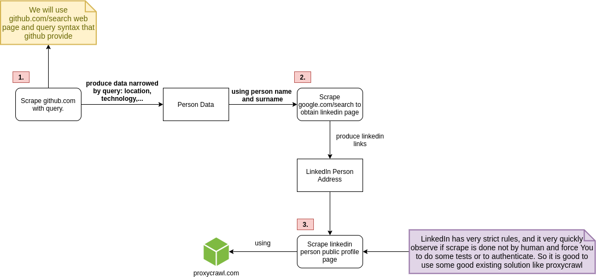

1. **Tutorial life example.**
- 1.1 **Our tutorial use cas** Let's imagine that You are a technical 
recruiter and You would like to automate some of Your tasks, maybe
gather data from few places, join it together, analyze it
and obtain powerful insights. So how to gather more information
about potential candidates and first of all how to automate this
process ?

- 1.2 **You need to lear how to find for free information** 
At the moment the internet is overflooded with information and
Your task is to find this information, i will tell You more,
there is many free resources that You can start using right away.
For example https://google.com/search has its own query language
that not many of use have ever used. Try to run this web address:
https://www.google.com/search?q=%3Asite+www.linkedin.com+docker+AND+argentina, 
You are right if You think it will return information which 
contain docker and argentina, possibly people.

- 1.3 **Treat Your information well** When You know from where You can obtain information, do it but be
gentle and not overuse the information, You want to make world better ?
You want to provide services on highest level right ? The purpose of 
scrapping is to find information about right audience, about people
who would benefit most from Your services.

- 1.4 **The goal is to get information You need and automate this!** So
in this tutorial I want to introduce You to scraping and fire up in You a
way how You think about obtaining information, information is there, free and
available, You need to start thinking how to use it and how to connect it.
**Scraping** is only a technique which You can learn. Associating different
information and taking out from it insights is something that comes with
experience and practise. Let's go !

2. **What is scrapping ?**
Scrapping define a process of extracting information from not structured
information, like HTML file. The process or program download the source of the
web page, HTML file and extract information from it, it extract links and define
rules which links should be followed. The extracted data is saved as structured
information.
 
- 1.1 **What is http://schema.org/**
It is a set of vocabulary which each good web page should use, thanks to it
scrapping the meaning from Your website is easier, when You define one of schema
types, spiders and scrapers knows how to treat information.

3. **Why one would use it ?** Imagine that You own a slave which does repetitive
tasks, do it very efficiently and always on time :). Yep so You can write a small
program with open source tools like scrapy https://scrapy.org/, it is a python
framework for scrapping, it handles all the low level things and allow You to
focus on logic how the scrapping should be done and what to do with information,
maybe save it into database ?

4. **Is scrapping legal ?** Google search engine does it all the time ? The thing
to consider is what You are doing with the data You scrapped ? Are You not 
making any harm to source from which You taken the data ? If You are publicly
using scrapped data You should inform the web pages from which You scrape, if they
are ok with the fact that You expose their data somewhere else. Remember be gentle
with data and remember about others, some web sites expose publicly data about
people, treat this data in a way that You would like somebody else treats data
about Yourself.

- 4.1. **robots.txt**
A robots.txt file is a set of rules how web page should be scrapped, 
it define which areas should be scrapped and how often.
"Despite the use of the terms "allow" and "disallow", 
the protocol is purely advisory and relies on the compliance of the web robot."
https://en.wikipedia.org/wiki/Robots_exclusion_standard

5. **Open Source** the solution to this tutorial example is 
here https://github.com/TECHS-Technological-Solutions/academy.tutorials.scrapy, but as You already reading it I guess You
found it :)



- 5.1. **github.com spider with scrapy**, I think that
technical recruitment start with technology, I know how it sounds.
So github.com is a place where technical people put information about
them self, about technologies they use, it is not as much business 
related as linkedin is. People use it to show their portfolio, show
how much their our contributing to open source projects, how active
they are as programmers. We want to use this web address:
https://github.com/search?q=location%3Arussia, it works similar 
as https://google.com/search, You can ask for data in a defined way
and scrap this information.

- 5.2 Github has search syntax which allow You to narrow the results.
- 1. https://docs.github.com/en/free-pro-team@latest/github/searching-for-information-on-github/about-searching-on-github
- 2. https://docs.github.com/en/free-pro-team@latest/github/searching-for-information-on-github/searching-users

- 5.3 The nice thing is, that each individual use webpage as this
https://github.com/IOR88 obey the http://schema.org/ vocabulary,
we can find there this schema http://schema.org/Person and 
what is better scrapy knows how to handle that. In scrapy we
define Item, item is an object where we store our scrapped data.
```python
class SchemaOrgPerson(scrapy.Item):
    """
    https: // schema.org / Person
    """
    schemaorg = 'http://schema.org/Person'

    image = scrapy.Field()
    name = scrapy.Field()
    additionalName = scrapy.Field()
    worksFor = scrapy.Field()
    homeLocation = scrapy.Field()
    email = scrapy.Field()
    url = scrapy.Field()
    follows = scrapy.Field()
    twitter = scrapy.Field()
    programmingLanguage = scrapy.Field()
``` 
- So above data is available on mentioned github page and we can
scrape it. The spider logic is available here:
**academy.tutorials.scrapy/atscrapy/atscrapy/spiders/github_search_spider.py**

- 5.4. **How much python I need to know**, not too much, scrapy is nice
because it is a framework it gives already structures You can work with, You mainly
focus on how to scrape a web resources and what to do with scrapped resources, maybe
save it to some text file. **But I highly recommend to learn xpath and css rules/syntax**.
Both are supported by scrapy, it is a way how You ask for data in DOM and how You traverse
the data, and this is critical when You write spider logic to scrape web sites.

6. **Using search engine to obtain links**, so google.com is a search engine
it is scrapping the web all the time, we will use it to get linkedin url for
person which interest us. So it is very important that url is correct as it 
linkedin is blocking requests very quickly if we want to scrape more we need
to use external tool, it would take us too much time to create reliable
solution, I recommend proxycrawl.com, we will use it as proxy API, we specify
url and proxycrawl is doing the scrapping.

- 6.1 **After scrapping github and google** this is what we have:
```json
  {
    "link": "https://www.linkedin.com/in/igormiazek/",
    "data": {
      "image": "",
      "name": "Igor Miazek",
      "additionalName": "IOR88",
      "worksFor": "",
      "homeLocation": "Remote",
      "url": "https://www.linkedin.com/in/igormiazek/",
      "follows": "",
      "programmingLanguage": [
        "Python",
        "R",
        "Jupyter Notebook"      
      ]
    }
  } 
```  

- 6.2 **Above results where achived with** for github.com we have used
this query **location:Remote language:Python** and for google.com we have
used this query **:site www.linkedin.com/in/ Name Surname**. For query for
github returned us information about it people who specialize in Python
technology and works remotely, than for each person returned from query we
have discovered linkedin address with google search.

- 6.3 **You can do the above by Yourself**, try to this: Go to https://github.com/search and copy paste this **location:Remote language:Python language:R language:"Jupyter Notebook"** I am not sure on which page my user will show because abuse mechanism was 
triggered when I was searching on pages. Than try to run this in https://google.com/search
**:site www.linkedin.com/in Igor Miazek**

- 6.4. **Why to scrape if I can do it manually?** Because of automation I say. You
are looking for best suited candidates and You want to speed this process as much as
possible in order to not waist time for talking with wrong people. With scrapping
You can quickly specify location, technologies, followers, user activity on github
for example maybe relevant.


The end, I hope You have enjoyed the tutorial, if You will be interesting about 
knowing more let me know, we could continue with proxycrawl.com 
https://www.scrapinghub.com/scrapy-cloud/, scrapy-cloud is great because You
don't need to take care about server and infrastructure, You just write the code for
spider and scrapy-cloud does the rest.